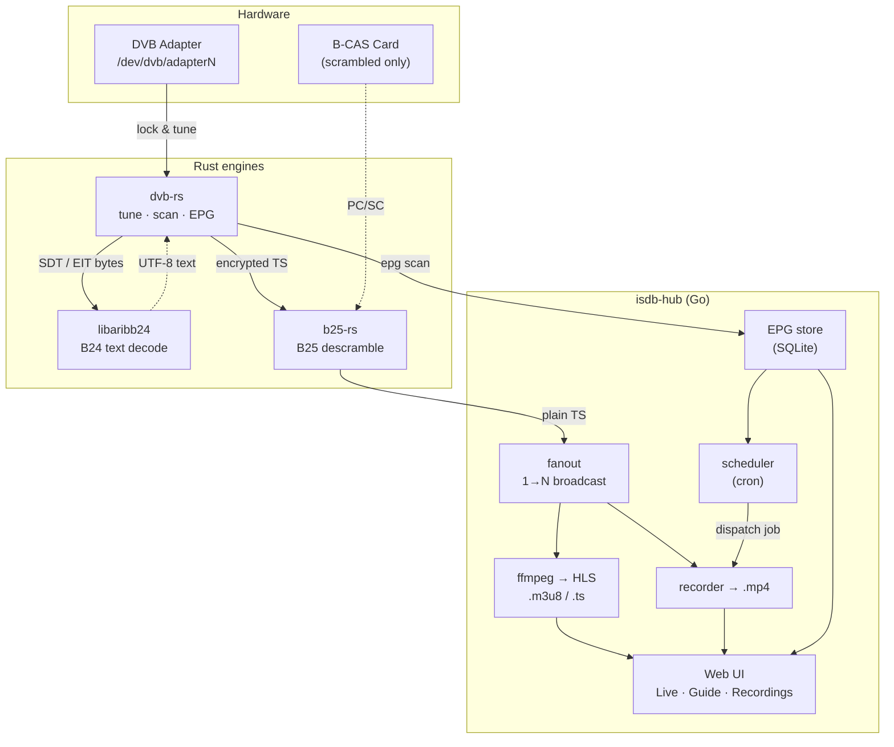

# ferrite

> Self-hosted **ISDB-T** TV stack — tune, descramble, record, and stream
> live to your LAN. One Go orchestrator driving three Rust engines.

This is the umbrella repo. The four components live in their own
repositories and are wired in as **git submodules**, so a single
recursive clone yields the entire stack at known-good commits.

```bash
git clone --recursive https://github.com/DuckFeather10086/ferrite.git
# or, if you already cloned without --recursive:
git submodule update --init --recursive
```

## The repos

| Repo | Role | Lang | Pinned branch |
|------|------|------|---------------|
| [**isdb-hub**](https://github.com/DuckFeather10086/isdb-hub) | orchestrator — owns adapters, EPG, scheduler, recorder, live HLS, web UI + REST API | Go | `feat/b25-pipeline-and-webui` |
| [**dvb-rs**](https://github.com/DuckFeather10086/dvb-rs) | tuner frontend — DVB API v5 `tune` / `scan` / `epg` over direct ioctls (no `libdvbv5`) | Rust | `fix/sdt-arib-b24` |
| [**libaribb25-rs**](https://github.com/DuckFeather10086/libaribb25-rs) | ARIB STD-B25 descrambler — MULTI2 decrypt via B-CAS card over PC/SC | Rust | `main` |
| [**libaribb24-rs**](https://github.com/DuckFeather10086/libaribb24-rs) | ARIB STD-B24 text decoder — SDT/EIT bytes → UTF-8 (service names, programme titles) | Rust | `main` |

> **Pinned branches.** `dvb-rs` and `isdb-hub` are pinned to in-flight
> feature branches (work not yet merged to `main`). After a recursive clone
> the submodules sit in detached HEAD at the pinned commit; to develop,
> `cd` in and `git checkout <branch>`. The tracked branch is recorded in
> `.gitmodules`. Run `git submodule update --remote` to fast-forward each
> submodule to the tip of its tracked branch.

## How it fits together



The hot path per active channel is a two-process pipe —
`dvb-rs tune … | b25-rs -v 0 - -` — broadcast 1→N by `fanout` (slow
consumers are dropped, never block live playback). `dvb-rs epg` feeds the
EPG store on a timer.

## Quickstart

```bash
# 1. Get everything
git clone --recursive https://github.com/DuckFeather10086/ferrite.git
cd ferrite

# 2. Build the Rust engines + the Go daemon
./bootstrap.sh build

# 3. Configure + run
#    Edit isdb-hub/configs/*.toml and channels.json for your adapter,
#    then start the daemon (serves the web UI + REST API):
cd isdb-hub && go run ./cmd/isdbd -config configs/isdbd.toml
```

Open the web UI in a browser (Live / Guide / Schedules / Recordings).

## Build

The two Rust build roots and the Go module build independently:

```bash
# Rust: libaribb24 + dvb-rs share the root virtual workspace
cargo build --release
#   → target/release/dvb-rs

# Rust: b25-rs has its own inner workspace (excluded from the root one)
cargo build --release --manifest-path libaribb25-rs/Cargo.toml
#   → libaribb25-rs/target/release/b25-rs

# Go orchestrator (CGO-free, web UI embedded)
cd isdb-hub && go build ./...
```

`bootstrap.sh` wraps these and verifies the submodules are checked out.

### Why two Cargo roots?

The root `Cargo.toml` is a virtual workspace over `libaribb24-rs` + `dvb-rs`
(`dvb-rs` depends on `libaribb24` by path). `libaribb25-rs` is **excluded**
because it carries its own inner workspace (`aribb25` lib + `b25-rs` bin).

## Releases

Pre-built tarballs for **linux/amd64** and **linux/arm64** are attached to
every [GitHub Release](https://github.com/DuckFeather10086/ferrite/releases).

```bash
# Pick your arch
curl -L "https://github.com/DuckFeather10086/ferrite/releases/download/v1.0.0/ferrite-v1.0.0-linux-amd64.tar.gz" | tar xz
cd ferrite-v1.0.0-linux-amd64

# Install system-wide
sudo cp isdb-hub dvb-rs b25-rs /usr/local/bin/
sudo mkdir -p /etc/isdbd && sudo cp configs/* /etc/isdbd/
sudo cp isdbd.service /etc/systemd/system/
```

Each tarball contains:

```
ferrite-vX.Y.Z-linux-{arch}/
├── isdb-hub              # Go daemon (web UI embedded, static binary)
├── dvb-rs               # Rust tuner
├── b25-rs                # Rust B25 descrambler
├── configs/           # example TOML + channels.json
├── isdbd.service      # systemd unit
├── README.md
└── VERSION
```

### Cutting a release

1. Bump `version` in `dvb-rs/Cargo.toml`, `libaribb25-rs/aribb25/Cargo.toml`,
   and `libaribb25-rs/b25/Cargo.toml` to the desired tag.
2. Commit: `chore: bump versions for vX.Y.Z`.
3. Tag: `git tag -a vX.Y.Z -m "Release vX.Y.Z" && git push --tags`.
4. CI builds both architectures and attaches the tarballs to the release.

## Runtime requirements

- A USB ISDB-T tuner at `/dev/dvb/adapter*/`.
- `ffmpeg` / `ffprobe` on `$PATH` (HLS remux + A/V-skew correction).
- For scrambled (non-FTA) channels: **`pcscd`** running + a B-CAS card
  reader (polkit rule for the invoking user). FTA-only setups can run
  without `b25-rs`.

## Maintainer notes

- Each submodule is a normal git clone — `cd` in, branch, commit, push
  as usual. The umbrella repo only records *which commit* of each it
  points at; bump a pointer with `git add <submodule> && git commit`.
- The canonical channel-matching rules live in `dvb-rs`
  (`config::find_entry`); `isdb-hub` mirrors them. Don't fork that logic.
- Architecture invariants (one process per adapter, stderr→slog,
  validate-bytes watchdog, drop-don't-block fanout) are documented in
  `isdb-hub/CLAUDE.md`.
